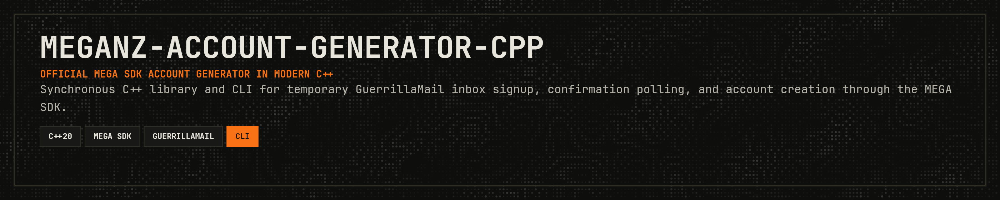

<p align="center">
  
</p>

<p align="center">
  <a href="https://en.cppreference.com/w/cpp/20"></a>
  <a href="https://cmake.org/"></a>
  <a href="https://opensource.org/licenses/MIT"></a>
  <a href="https://git.woldtech.nl/woldtech/mega/meganz-account-generator-cpp"></a>
</p>

<p align="center">
  <a href="#dependency-inputs">Dependency Inputs</a> · <a href="#build-prerequisites">Build Prerequisites</a> · <a href="#configure-and-build">Configure And Build</a> · <a href="#public-c-api">Public C++ API</a> · <a href="#cli-usage">CLI Usage</a> · <a href="#runtime-expectations">Runtime Expectations</a> · <a href="#end-to-end-verification">End-to-End Verification</a> · <a href="#troubleshooting-local-runs">Troubleshooting</a> · <a href="#source-layout">Source Layout</a>
</p>

---

C++ implementation of a MEGA account generator built around the official MEGA SDK and the `guerrillamail-client-c` C ABI.

This repository currently contains:

- explicit MEGA SDK and GuerrillaMail dependency wiring
- internal wrapper layers for GuerrillaMail and MEGA SDK requests
- a public C++ library API
- a thin CLI frontend over that library
- a Pass 3 core account-generation workflow behind the public boundary
- deterministic local tests and an opt-in end-to-end verification harness

## Dependency Inputs

This repository does not guess dependency locations for external installs.

The supported inputs are:

- `GUERRILLAMAIL_CLIENT_C_PROFILE`
  - Optional
  - `Debug` or `Release`
  - Controls the Cargo profile used to build the bundled `third_party/guerrillamail-client-c` submodule

Additional prerequisite:

- `cargo` must be installed and available on `PATH`

## Build Prerequisites

You need:

- CMake 3.20 or newer
- a C compiler with C11 support
- a C++ compiler with C++20 support
- the bundled `third_party/meganz-sdk` submodule initialized
- the bundled `third_party/guerrillamail-client-c` submodule initialized
- `cargo` installed and available on `PATH`

Depending on how your local `meganz/sdk` checkout is configured, you may also need to provide
explicit discovery hints for upstream dependencies such as ICU and Crypto++.

## Supported Build Shape

The project integrates:

- `meganz/sdk` as a CMake subdirectory from the bundled `third_party/meganz-sdk` submodule
- `guerrillamail-client-c` from the bundled `third_party/guerrillamail-client-c` submodule via `cargo build`
- the bundled GuerrillaMail C ABI as a static library, so the app does not depend on a separate
  GuerrillaMail runtime DLL at launch

The project disables unused MEGA SDK extras by default:

- `ENABLE_SDKLIB_EXAMPLES=OFF`
- `ENABLE_SDKLIB_TESTS=OFF`
- `ENABLE_SDKLIB_WERROR=OFF`
- `USE_FREEIMAGE=OFF`
- `USE_FFMPEG=OFF`
- `USE_PDFIUM=OFF`
- `USE_READLINE=OFF`

Those defaults can be overridden through normal CMake cache editing if needed later.

## Configure And Build

Initialize the bundled submodules after cloning:

```bash
git submodule update --init --recursive
```

Example configure:

```bash
cmake -S . -B build \
  -DCMAKE_BUILD_TYPE=Debug \
  -DGUERRILLAMAIL_CLIENT_C_PROFILE=Debug

cmake --build build -j
```

If you use a multi-config generator such as Visual Studio, add `--config Debug` to `cmake --build`
and `-C Debug` to `ctest`.

If your local `meganz/sdk` checkout relies on system package discovery for Crypto++ and ICU, pass those hints explicitly instead of assuming CMake will find them on its own.

Verified on this machine with the bundled GuerrillaMail submodule:

```bash
PKG_CONFIG_PATH=/opt/homebrew/opt/cryptopp/lib/pkgconfig \
cmake -S . -B build \
  -DCMAKE_BUILD_TYPE=Debug \
  -DGUERRILLAMAIL_CLIENT_C_PROFILE=Debug \
  -DCMAKE_PREFIX_PATH=/opt/homebrew/opt/icu4c@78 \
  -DICU_ROOT=/opt/homebrew/opt/icu4c@78

cmake --build build -j4
```

## Architecture

The current implementation is split into these layers:

- `include/meganz_account_generator/`
  - stable public headers for ordinary C++ callers
- `src/public/`
  - translation layer between the public API and internal orchestration
- `src/core/`
  - synchronous account-generation flow, confirmation-link parsing, and retry policy
- `src/mega/`
  - synchronous request bridge over the callback-based MEGA SDK
- `src/mail/`
  - RAII wrapper over the blocking `guerrillamail-client-c` API
- `src/cli/`
  - thin command-line frontend over the public library API
- `tests/`
  - deterministic seam-level tests plus an opt-in live end-to-end harness

## Public C++ API

Public headers live under:

- `include/meganz_account_generator/`

The current public entry point is:

- `meganz_account_generator::AccountGenerator`

It uses:

- `meganz_account_generator::AccountGeneratorConfig`
- `meganz_account_generator::GeneratedAccount`

Link ordinary C++ code against:

- `meganz_account_generator_cpp::library`

Minimal example:

```cpp
#include "meganz_account_generator/account_generator.hpp"

int main()
{
    meganz_account_generator::AccountGeneratorConfig config{
        .app_key = "your-mega-app-key",
        .password = "your-test-password",
        .display_name = "Automation Bot",
    };

    meganz_account_generator::AccountGenerator generator(config);
    const auto account = generator.generate();
}
```

The public API is synchronous. Public headers do not expose the GuerrillaMail C ABI or MEGA
listener plumbing.

## CLI Usage

The CLI target is:

- `meganz_account_generator_cpp_cli`

Show help with:

```bash
./build/src/meganz_account_generator_cpp_cli --help
```

With Visual Studio generators, the executable path is typically:

```bash
./build/src/Debug/meganz_account_generator_cpp_cli --help
```

The CLI requires:

- `--password <value>`

Optional first-run flags:

- `--display-name <value>`
- `--proxy <url>`
- `--timeout-ms <milliseconds>`
- `--poll-interval-ms <milliseconds>`

Example:

```bash
./build/src/meganz_account_generator_cpp_cli \
  --password 'your-test-password' \
  --display-name 'Automation Bot'
```

The CLI generates a fresh random app key locally on each run and passes it through to the MEGA SDK
for that process. It does not register or persist app keys. The CLI is a thin frontend over the
public library API. It does not expose internal wrapper types or direct SDK calls. On success it
prints the created email and display name, but not the user-supplied password.

## Runtime Expectations

A real account-generation run requires:

- network access to both MEGA and GuerrillaMail
- a password supplied by the caller or CLI user
- enough time for GuerrillaMail delivery and MEGA confirmation processing

For library callers, that also means supplying a valid MEGA app key in
`meganz_account_generator::AccountGeneratorConfig`. The CLI now generates a fresh random app key
for each run instead of accepting one as input.

If you provide a proxy, the library uses it for both the MEGA SDK and GuerrillaMail wrapper.

## End-to-End Verification

The repository includes an opt-in CTest target, `account_generator_e2e_test`, that exercises
`meganz_account_generator::AccountGenerator` from library code and attempts one real MEGA signup
using a temporary GuerrillaMail inbox.

Required environment variables:

- `MEGANZ_ACCOUNT_GENERATOR_CPP_E2E_APP_KEY`
- `MEGANZ_ACCOUNT_GENERATOR_CPP_E2E_PASSWORD`

Optional environment variables:

- `MEGANZ_ACCOUNT_GENERATOR_CPP_E2E_DISPLAY_NAME`
  - default: `Automation Bot`
- `MEGANZ_ACCOUNT_GENERATOR_CPP_E2E_PROXY`
- `MEGANZ_ACCOUNT_GENERATOR_CPP_E2E_TIMEOUT_MS`
  - default: `300000`
- `MEGANZ_ACCOUNT_GENERATOR_CPP_E2E_POLL_INTERVAL_MS`
  - default: `5000`

Build and run it with:

```bash
cmake -S . -B build \
  -DCMAKE_BUILD_TYPE=Debug

cmake --build build -j4

MEGANZ_ACCOUNT_GENERATOR_CPP_E2E_APP_KEY=your-app-key \
MEGANZ_ACCOUNT_GENERATOR_CPP_E2E_PASSWORD='your-test-password' \
ctest --test-dir build -R account_generator_e2e_test --output-on-failure
```

On multi-config generators such as Visual Studio, use `cmake --build build --config Debug` and
`ctest --test-dir build -C Debug`.

If the required environment variables are not set, `account_generator_e2e_test` exits with
code `77` and CTest reports it as skipped.

This harness depends on external MEGA and GuerrillaMail availability. Network issues, service
outages, email delivery delays, and proxy misconfiguration can all cause the live verification
to fail even when the deterministic local suite is green.

## Verified Locally

Verified in this repository:

- `cmake --build build --target meganz_account_generator_cpp_cli cli_random_app_key_test public_api_usage_test --config Debug`
- `ctest --test-dir build -C Debug -R "cli_help_test|cli_random_app_key_test|public_api_usage_test" --output-on-failure`
- `.\build\src\Debug\meganz_account_generator_cpp_cli.exe --help`

Not verified in this pass:

- a live MEGA plus GuerrillaMail end-to-end signup run
- any scenario that requires real network access or externally supplied E2E credentials

## Troubleshooting Local Runs

Common local issues:

- configure fails before generation
  - confirm the bundled `third_party/meganz-sdk` submodule is initialized
  - confirm the bundled `third_party/guerrillamail-client-c` submodule is initialized
- bundled `guerrillamail-client-c` fails during configure or build
  - make sure `cargo` is installed and available on `PATH`
- MEGA SDK dependency discovery fails
  - pass explicit ICU and Crypto++ discovery hints for your local machine instead of relying on
    implicit system lookup
- `account_generator_e2e_test` is skipped
  - set `MEGANZ_ACCOUNT_GENERATOR_CPP_E2E_APP_KEY` and
    `MEGANZ_ACCOUNT_GENERATOR_CPP_E2E_PASSWORD`
- live runs time out while waiting for confirmation mail
  - verify outbound network access
  - verify the MEGA app key is valid
  - verify any configured proxy is reachable and correct
  - expect occasional delivery delays from external services

## Source Layout

The repository is organized by layer:

- `cmake/`
  - local CMake helpers
- `include/`
  - public headers
- `src/`
  - project sources
- `src/core/`
  - high-level signup orchestration
- `src/mail/`
  - GuerrillaMail wrapper layer
- `src/mega/`
  - MEGA SDK integration layer
- `src/cli/`
  - thin command-line frontend
- `tests/`
  - unit tests and optional live verification harness

The current implementation follows the mail, mega, core, and cli layering described in
`AGENTS.md`.

## Support

If this crate saves you time or helps your work, support is appreciated:

[](https://ko-fi.com/11philip22)

## License

This project is licensed under the MIT License; see the [license](https://opensource.org/licenses/MIT) for details.